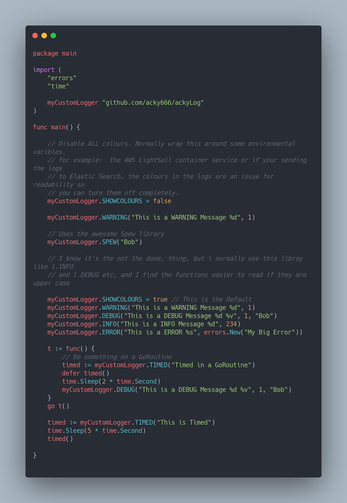
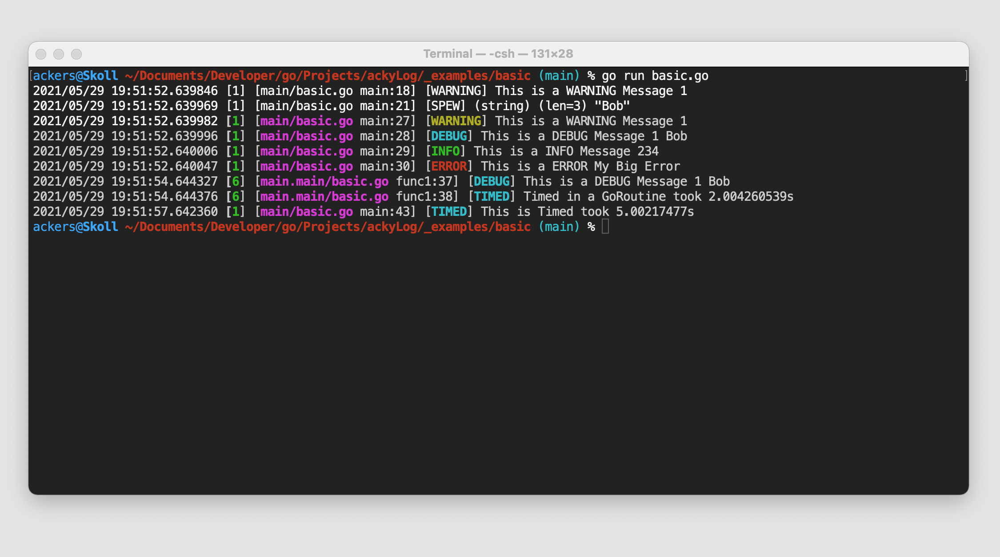

# ackyLog

Incredibly Simple custom logger that adds a few extra bells and whistles on standard logging in Go.

## Requirements 

Just Go. Developed with Go 1.16.4

## Dependancies 

Uses the rather awesome github.com/davecgh/go-spew library. No other dependancies 

## Usage

This Outputs like this.

